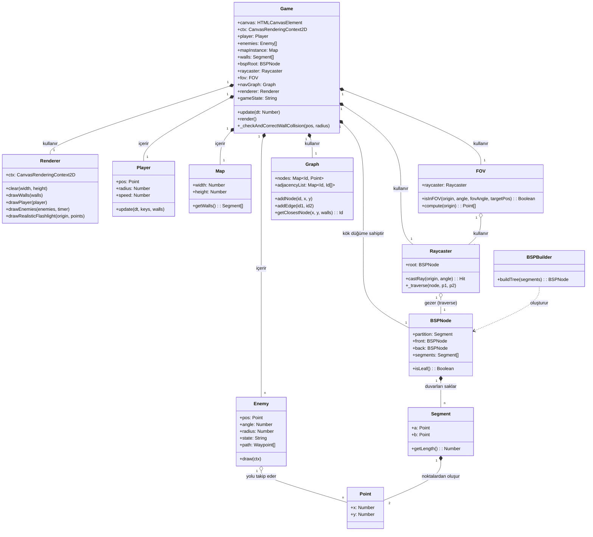

# Proje 6: BSP Ağacı Tabanlı Görüş Alanı ve Çarpışma Tespiti

Bu proje, Veri Yapıları dersi kapsamında 2 boyutlu, kuşbakışı (top-down) oynanan bir gizlilik oyunu simülasyonudur. Projenin temel amacı, otonom düşmanların bulunduğu bir labirentte görüş alanı (FOV), yol bulma (pathfinding) ve çarpışma tespiti gibi problemleri, kendi yazdığımız veri yapılarıyla optimize ederek çözmektir.
Çalışmamınızın videosuna aşağıdaki linkten ulaşabilirsiniz.

[Video Linki](https://drive.google.com/file/d/12cqvNDei-LixEN3LCTDeu0qT-X-PHx4F/view?usp=sharing)

## 1. Sistem Mimarisi ve Eşzamanlılık

Projede B.1 değerlendirme kriteri olan "Eşzamanlılık ve Mikroservis Yaklaşımı" şartını sağlamak amacıyla monolitik bir yapıdan kaçınılmıştır. Sistem iki ayrı servise bölünmüştür:

* **Frontend (İstemci):** HTML5 Canvas ve Vanilla JavaScript ile yazılmıştır. Klavye girdilerini okur, anlık gölge/görüş alanı çizimlerini (render) yapar ve çarpışma fiziklerini hesaplar.
* **AI API (Yapay Zeka Servisi):** Düşmanların yol bulma (A*) simülasyonları ana bellekten bağımsız çalışması için Python ve Flask kullanılarak ayrı bir backend servisi (Thread-safe) olarak tasarlanmıştır. Frontend, bu servise asenkron istekler atarak arayüzün donmasını engeller.

## 2. Kurulum ve Çalıştırma (Docker)

Sistemi herhangi bir ortam bağımlılığı yaşamadan tek komutla ayağa kaldırmak için Docker kullanılmıştır. Proje dizininde terminali açıp aşağıdaki komutu çalıştırmanız yeterlidir:

`docker-compose up --build`

Uygulama ayağa kalktığında oyun arayüzüne http://localhost:8080 adresinden ulaşabilirsiniz.

### Kullanılan Docker Konfigürasyonları

**Dockerfile (AI Servisi İçin):**
```dockerfile
FROM python:3.10-slim
WORKDIR /app
COPY requirements.txt .
RUN pip install -r requirements.txt
COPY . .
EXPOSE 5000
CMD ["python", "app.py"]
```

**docker-compose.yml:**
```yaml
version: '3.8'

services:
  # Oyun Ekranı (Frontend)
  game_frontend:
    build: .
    ports:
      - "8080:80"
    volumes:
      - .:/usr/share/nginx/html

  # Yapay Zeka Servisi (AI Service)
  ai_service:
    build: ./ai_service
    ports:
      - "5000:5000"
    volumes:
      - ./ai_service:/app
```

## 3. Veri Yapıları ve Big-O Zaman Karmaşıklığı Analizi

Projede istenen çekirdek veri yapıları standart kütüphaneler (örneğin hazır priority queue paketleri) kullanılmadan sıfırdan yazılmıştır.

| Veri Yapısı | Kullanım Amacı | Ortalama Karmaşıklık | En Kötü Durum |
| :--- | :--- | :--- | :--- |
| **BSP Ağacı** | Duvar segmentlerini saklamak ve ışın/görüş alanı sorgularını tüm haritayı taramadan hızlıca yapmak. | O(log N) | O(N) |
| **Graf (Adjacency List)** | Yürünebilir alanları koordinat düğümleri (waypoint) olarak bağlayıp harita topolojisini oluşturmak. | Düğüm Erişimi: O(1) | Düğüm Erişimi: O(N) |
| **Min-Heap (Priority Queue)** | A* algoritması çalışırken "en düşük maliyetli" yolu hızlıca çekmek için kullanılmıştır. | Ekleme/Çıkarma: O(log N) | O(log N) |
| **Dinamik Dizi** | Raycasting sonucunda dönen anlık ışın kesişim noktalarını ve poligon köşelerini tutmak. | Ekleme: O(1) | Ekleme: O(N) |

*(Not: Tablodaki N değeri haritadaki duvar/düğüm sayısını temsil etmektedir.)*

## 4. Kullanılan Algoritmalar (Faz 2)

* **Raycasting ve Line of Sight (LOS):** Düşmanların oyuncuyu görüp görmediğini anlar. Her karede yüzlerce ışın fırlatmak yerine, BSP ağacı kullanılarak ışının gitmediği yönlerdeki duvarlar testten çıkarılır (budama/pruning) ve gereksiz testler azaltılır.
* **A* Pathfinding:** Düşmanların hedefe giderken duvarlara takılmadan en kısa yolu bulmasını sağlar. f(n) = g(n) + h(n) formülü ile çalışır.
* **Çarpışma Tespiti (Circle vs Segment):** Oyuncu ve düşmanların duvarların içinden geçmesini engeller. 

## 5. Proje Mimarisi ve UML İskeleti

Projenin modüler dosya yapısı aşağıdaki gibidir:

```text
/veri-yapilari-proje
├── /ai_service             -> Python AI Mikroservisi
│   ├── app.py
│   └── requirements.txt
├── /src
│   ├── /ai                 -> Min-Heap, Graf ve A* algoritmaları
│   ├── /map                -> Duvar üretimi ve BSP Ağacı inşası
│   ├── /physics            -> Çarpışma ve raycasting matematiksel formülleri
│   └── /core               -> Oyun döngüsü (game loop) ve karakter kontrolleri
├── index.html              -> HTML5 Canvas arayüzü
├── docker-compose.yml
└── README.md
```


## 6. Temel Mimari Kararlar

### 6.1 Mantık ve Görselleştirmenin Ayrılması (Separation of Logic and Rendering)
`Game` sınıfı bir orkestra şefi (orchestrator) görevi görür. Oyun döngüsünü ve durumunu yönetir, ancak görsel çizim işlerini `Renderer` sınıfına devreder. Bu, temel oyun mekaniklerini etkilemeden görsel stilin kolayca değiştirilmesine olanak tanır.

### 6.2 Uzamsal Bölümleme için BSP Ağacı (BSP Tree for Spatial Partitioning)
Çevre, duvar segmentlerini organize etmek için bir **İkili Uzay Bölümleme (Binary Space Partitioning - BSP)** ağacı kullanır. Bu, `Raycaster` modülünün ışın kesişim testlerini her duvarla tek tek yapmak yerine, ışının menzilinde olmayan ağaç dallarını budayarak (pruning) **O(log N)** süresinde yapmasını sağlar.

### 6.3 Navigasyon Grafı ve A* (Navigation Graph & A*)
Yol bulma mekanizması, fizik motorundan bağımsızdır. Başlangıçta ızgara tabanlı bir **Navigasyon Grafı** oluşturulur. Bu graf sadece yürünebilir alanlardaki düğümleri içerir ve kenarlar (edges) yalnızca duvarlarla kesişmiyorsa oluşturulur. A* algoritması, öncelik kuyruğu işlemleri için özel olarak yazılmış bir **Min-Heap** yapısı kullanır.

### 6.4 Görüş ve Engel Yönetimi (Vision & Occlusion)
`FOV` sınıfı, Görüş Hattı (Line of Sight - LOS) kontrolleri için birleşik bir arayüz sağlar. Bir hedefin görünür olup olmadığını belirlemek için BSP tabanlı `Raycaster`'ı kullanır. Bu sayede duvarların hem yapay zeka algısını hem de görsel ışık efektlerini doğru bir şekilde engellemesi garanti edilir.


## 7. Üretken Yapay Zeka (GenAI) Kullanım Dökümü

Geliştirme sürecinde matematiksel formüllerin sağlamasını yapmak ve test haritaları oluşturmak için yapay zeka araçlarından destek alınmıştır. Kullanılan bazı prompt örnekleri:

* **Çarpışma Fiziği Promptu:** *"JavaScript ile bir nokta ve bir çizgi segmenti arasındaki en yakın izdüşüm noktasını bulan (closest point on segment) matematiksel fonksiyonu yazar mısın? Çıkan sonucu duvar çarpışmalarında (sliding) kullanacağım."*
* **Test Verisi (Sentetik Veri) Promptu:** *"Kuşbakışı bir 2D oyun için 1200x700 boyutlarında, içinde döngüsel çıkmaz sokaklar olan 10 adet duvar segmentinin (x1, y1, x2, y2) JSON formatında koordinatlarını üret."*

### 7.1 Algoritma Geliştirme ve İyileştirme
* **Görüş Hattı (LOS) ve Engel Denetimi:** BSP ağacı tabanlı raycasting algoritması kullanılarak, düşmanların duvarların arkasını görmesini engelleyen `isInFOV` mantığı yapa zeka tarafından kurgulanmış ve entegre edilmiştir.
* **Yol Bulma (Pathfinding) Refaktörü:** Sistemin Python mikroservis bağımlılığı kaldırılarak, yerel JavaScript tabanlı A* algoritmasına geçişi sağlanmıştır. Bu süreçte navigasyon grafının duvar kesişimlerini hesaplaması için gerekli geometrik fonksiyonlar üretilmiştir.
* **AI Davranış Modelleri:** Düşmanların oyuncuyu kaybettiklerinde son görülen konuma gitmesi ve ardından devriye moduna geçmesi gibi durum makinesi (FSM) iyileştirmeleri yapılmıştır.

### 7.2 Hata Ayıklama (Debugging)
* **Kapsam ve Referans Hataları:** Oyun döngüsü içinde tanımlanmamış olan `dxToPlayer`, `dyToPlayer` ve `enemyViewAngle` gibi kritik değişkenlerin neden olduğu `ReferenceError` hataları otonom olarak tespit edilmiş ve düzeltilmiştir.
* **Tip Hataları:** Eksik metot tanımları (`isInFOV is not a function`) için savunmacı programlama blokları eklenmiş ve modül yükleme sorunları giderilmiştir.

### 7.3 Dokümantasyon ve Modelleme
* **UML Modelleme:** Projenin tüm bileşenlerini ve ilişkilerini gösteren Mermaid tabanlı sınıf diyagramları yapay zeka tarafından analiz edilerek oluşturulmuştur.
* **Mimari Dokümantasyon:** Projenin teknik kararlarını açıklayan `ARCHITECTURE.md` dosyası Türkçe olarak hazırlanmıştır.

### 7.4 Örnek Promptlar
* *"Düşmanların görüş konisi (FOV) içinde olup olmadığını kontrol eden ve aradaki duvarları BSP raycaster ile sorgulayan isInFOV fonksiyonunu yazar mısın?"*
* *"Python'daki A* mikroservisini iptal edip, projedeki src/ai altındaki JS dosyalarını kullanarak yerel bir yol bulma sistemi kur."*
* *"Navigasyon grafı oluşturulurken, düğümler arası kenarların duvarları kesip kesmediğini kontrol eden bir segment-intersection algoritması ekle."*


